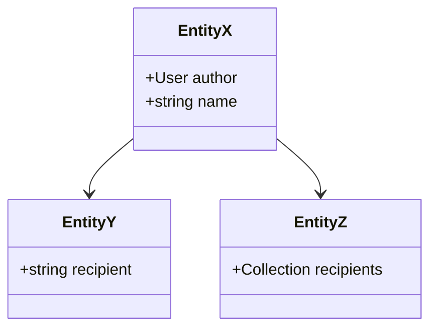
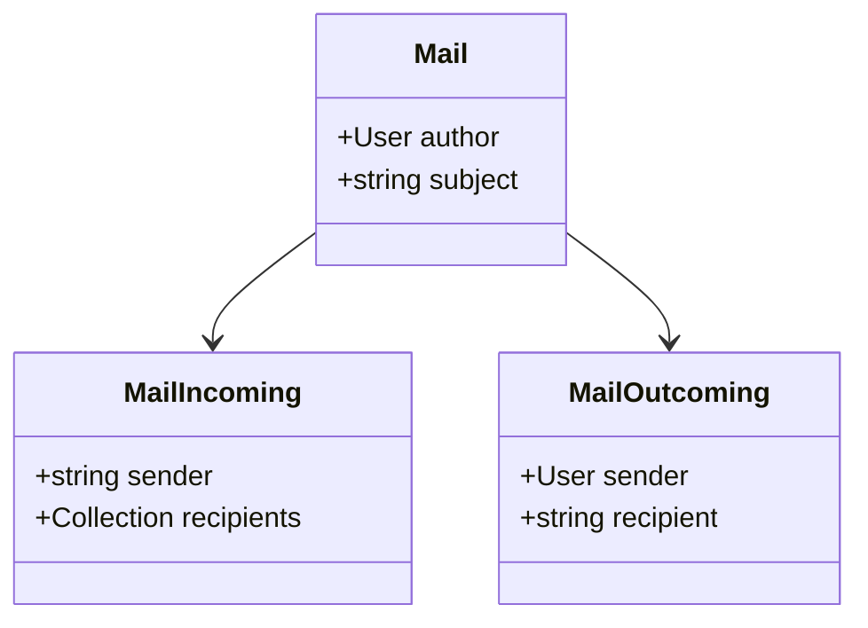
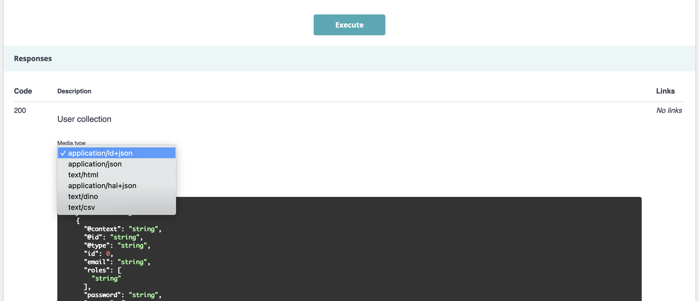
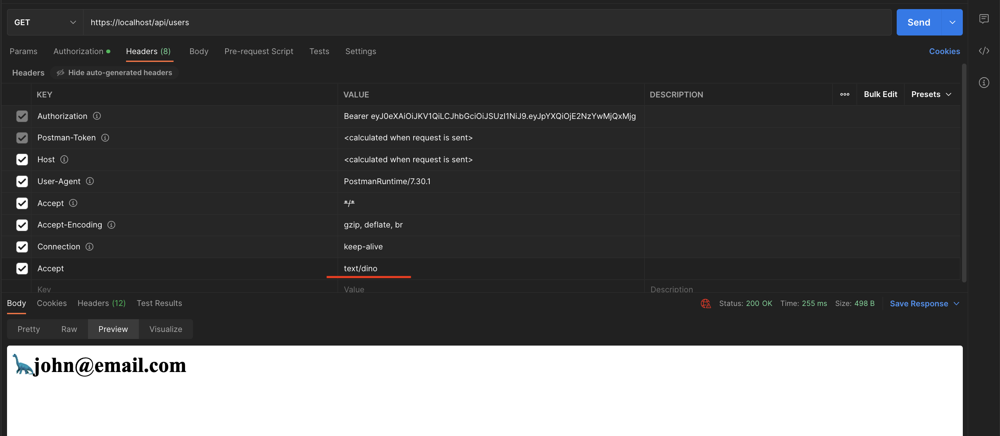
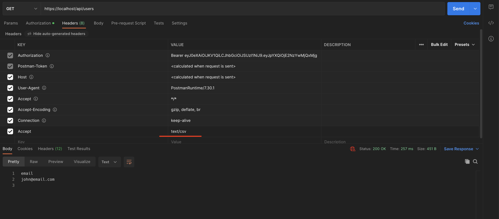

# Api platform 3

Generated from template https://github.com/dunglas/symfony-docker

## Getting Started

1. If not already done, [install Docker Compose](https://docs.docker.com/compose/install/) (v2.10+)
2. Run `docker compose build --pull --no-cache` to build fresh images
3. `make start`
4. `make sh` to enter php container
5. `php bin/console lexik:jwt:generate-keypair`
6. Open `https://localhost` in your favorite web browser and [accept the auto-generated TLS certificate](https://stackoverflow.com/a/15076602/1352334)
7. Run `docker compose down --remove-orphans` to stop the Docker containers.

### Create and fill database

`make sh` (if you're not in the php container allready) 

`php bin/console doctrine:database:create`

`php bin/console doctrine:schema:update --force`

### Create User

`POST https://localhost/api/register`

```json
{
    "email": "john@email.com",
    "password": "B2#Etw8BN3zi"
}
```

### Authentication

`POST https://localhost/api/login_check`

```json
{
    "email": "john@email.com",
    "password": "B2#Etw8BN3zi"
}
```

## Docs

### [Summary of](docs/Doctrine/index.md) Association Override, Attribute Override, Mapped Superclasses

### [EntityA EntityB](docs/EntityAB/index.md) Example using `InheritanceType` in mode `SINGLE_TABLE`

PR related: https://github.com/aratinau/api-platform3/pull/1

### [EntityX EntityY EntityZ](docs/EntityXYZ/index.md) Example using `MappedSuperclass` on abstract class



Example of
- `MappedSuperclass` and Get Collection of EntityY and EntityZ on same GetCollection
- Automatically applies the author with the Interface `AuthorInterface.php` and the Subscriber `AttachAuthorSubscriber`

PR related: https://github.com/aratinau/api-platform3/pull/2

### [Mail MailIncoming MailOutcoming](docs/Mail/index.md) of 🚀 `InheritanceType` in mode `JOINED`



PR related: https://github.com/aratinau/api-platform3/pull/3

### Format `text/csv`, `text/dino 🦕`



```bash
curl -X 'GET' \
  'https://localhost/api/users?page=1' \
  -H 'accept: text/dino'
```



```bash
curl -X 'GET' \
  'https://localhost/api/users?page=1' \
  -H 'accept: text/csv'
```



PR related: https://github.com/aratinau/api-platform3/pull/4

## Notes

    "hydra:description": "Unable to generate an IRI for the item of type \"App\\Entity\\EntityB\""
    This was happening because the entity was never being saved, so the id was never generated.
    https://stackoverflow.com/questions/57887026/unable-to-generate-an-iri-for-the-item-of-type-exception-after-api-platform-mi

## Fix 🔧

- `UniqueEntity('email')`
- `php bin/console hautelook:fixtures:load`
- `POST https://localhost/api/entity_bs`

## Roadmap 🛣️

- fork from dunglas/symfony-docker
- install doctrine, api-platform, fixtures

```shell
composer require symfony/orm-pack
composer require --dev symfony/maker-bundle
```    

- Creation Book entity + fixtures

    - filter on `category[]`

- Install Lexik JWT

  - `composer require "lexik/jwt-authentication-bundle"`
  - `php bin/console lexik:jwt:generate-keypair`


## TODO 📝

### User
- [ ] mail confirmation
- [ ] resend mail confirmation (expiration date)


- [ ] password forgot
- [ ] change password forgot


- [ ] update mail (resend confirmation mail + expiration date)
- [ ] update password (need current password)

### File

- [ ] multipart

### Misc
- [ ] enum instead array in Book $category

### MappedSuperclass

- [ ] hydrate the results by iri
- [ ] paginate results
- [ ] order results
- [ ] filter results
