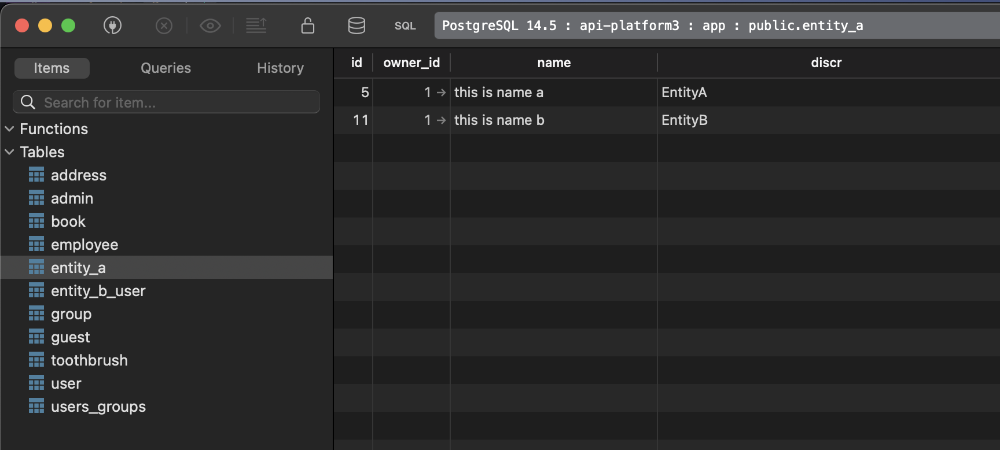

# EntitiyA EntitiyB

    InheritanceType SINGLE_TABLE

### Request

`POST https://localhost/api/entity_as`

```json
{
    "owner": "/api/users/1",
    "name": "this is name a"
}
```

### Response

```json
{
    "@context": "/api/contexts/EntityA",
    "@id": "/api/entity_as/1",
    "@type": "EntityA",
    "name": "this is name a",
    "owner": "/api/users/1"
}
```

### Request

`POST https://localhost/api/entity_bs`

```json
{
    "owner": "/api/users/1",
    "owners": ["/api/users/1"],
    "name": "this is name toto"
}
```

### Response

```json
{
    "@context": "/api/contexts/Error",
    "@type": "hydra:Error",
    "hydra:title": "An error occurred",
    "hydra:description": "Unable to generate an IRI for the item of type \"App\\Entity\\EntityB\"",
}
```

### Result in database


