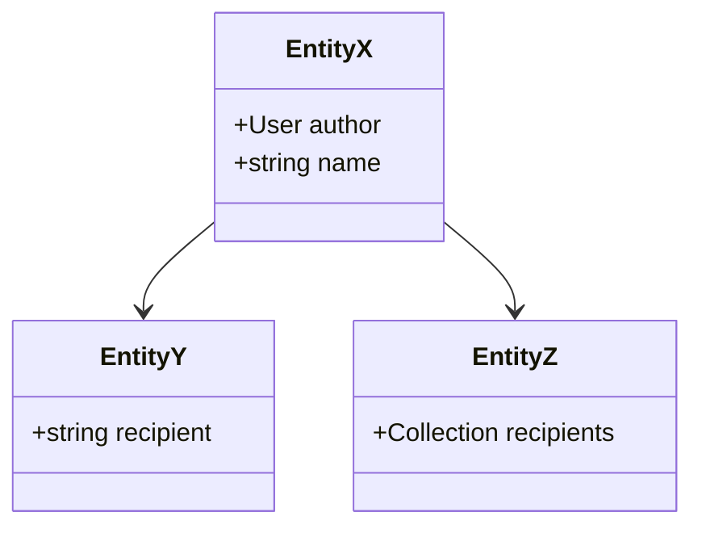

# EntitiyX EntitiyY EntitiyZ

    MappedSuperclass




### Request

`POST https://localhost/api/entity_ys`

```json
{
    "recipient": "recipent string",
    "name": "this is name a"
}
```

### Response

```json
{
    "@context": "/api/contexts/entity_ys",
    "@id": "/api/entity_ys/15",
    "@type": "entity_ys",
    "recipient": "recipent string",
    "name": "this is name a",
    "author": "/api/users/1"
}
```

### Request

`POST https://localhost/api/entity_zs`

```json
{
    "recipients": ["/api/users/1"],
    "name": "this is name toto"
}
```

### Response

```json
{
    "@context": "/api/contexts/EntityZ",
    "@id": "/api/entity_zs/10",
    "@type": "EntityZ",
    "recipients": [
        "/api/users/1"
    ],
    "name": "this is name toto",
    "author": "/api/users/1"
}
```

### Request

`GET https://localhost/api/entity_xes`

### Response

```json
{
    "@context": "/api/contexts/EntityX",
    "@id": "/api/entity_xes",
    "@type": "hydra:Collection",
    "hydra:member": [
        {
            "id": 11,
            "name": "this is name toto",
            "entity": "z"
        },
        {
            "id": 15,
            "name": "this is name a",
            "entity": "y"
        },
        {
            "id": 10,
            "name": "this is name toto",
            "entity": "z"
        }
    ],
    "hydra:totalItems": 3
}
```
